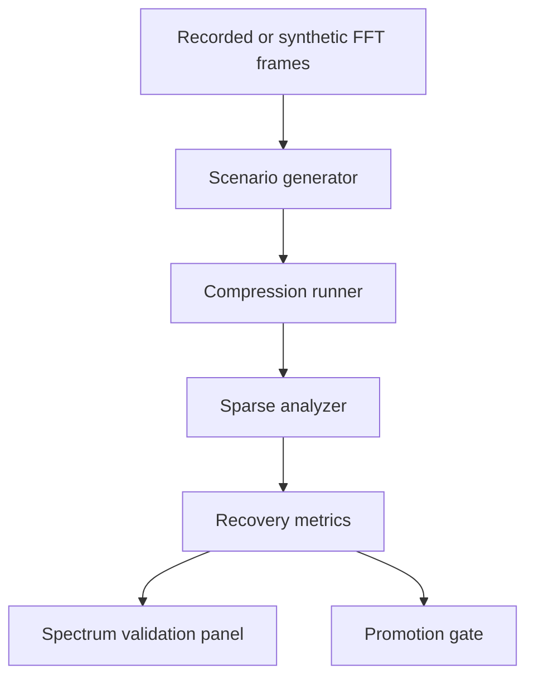
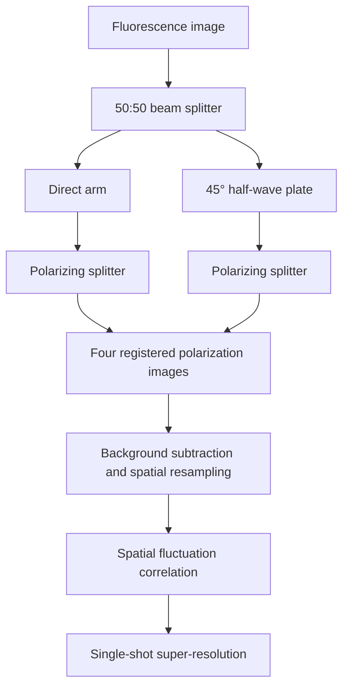
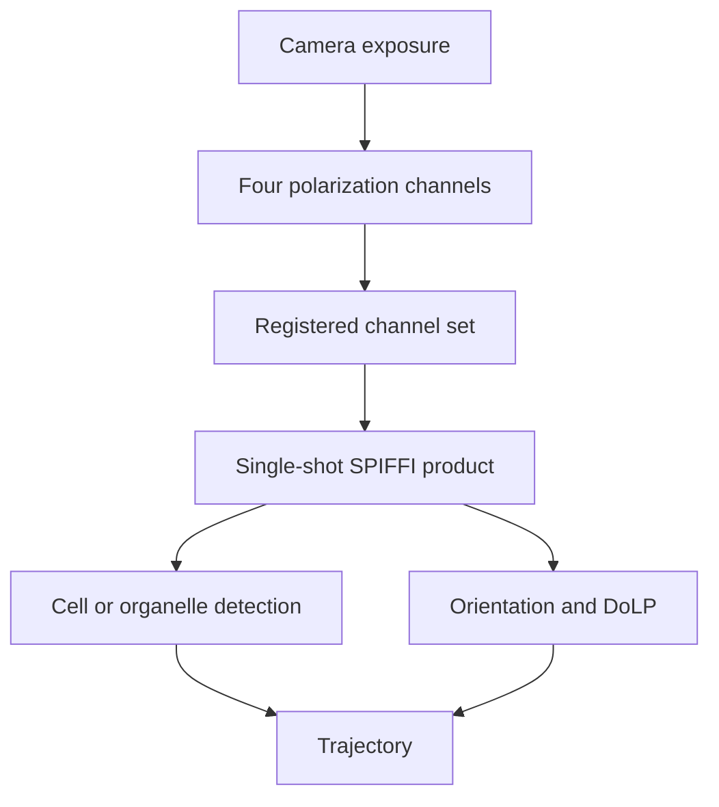
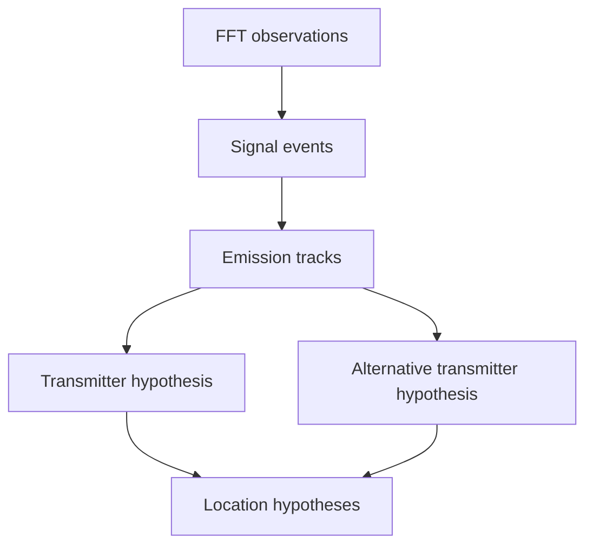
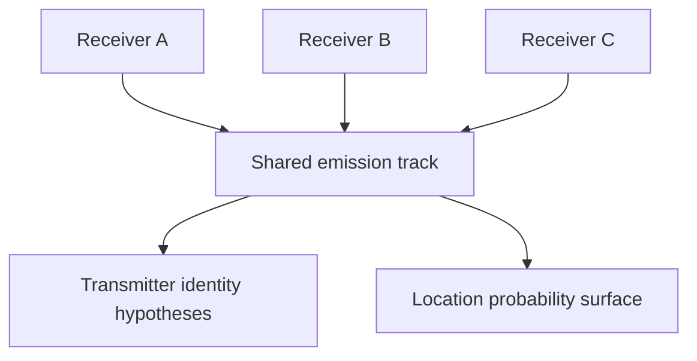

The paper helps SCYTHE most as a methodology for evidence-qualified sparse recovery—not as permission to claim the NESDR has become a drone radar.

The source paper — Rai, Alex and Chattopadhyay, [*Multi-Target Micro-Motion Parameter
Estimation using MIMO-FMCW Radar with Limited Measurements*](https://arxiv.org/abs/2608.05216),
arXiv:2608.05216 (5 August 2026) — uses:

1. random measurement selection;
2. bulk-component estimation and subtraction;
3. residual micro-motion extraction;
4. a physically parameterized dictionary;
5. 1D orthogonal matching pursuit;
6. explicit hit-rate/RMSE evaluation across compression and SNR;
7. classification only after parameter recovery.

SCYTHE has already transplanted the useful skeleton:

```text
bounded FFT frames
  → temporal background
  → residual spectrum
  → candidate regions
  → peak-track carrier model
  → OMP periodic-amplitude model
  → support or explicit null outcome
```

## What transfers directly

### 1. A proper compression benchmark

The paper’s principal lesson is not “OMP finds drones.” It is that reduced measurements can preserve parameter estimation under specific sparsity and separability conditions.

Expand SCYTHE’s compression test from a single 0.5 regression into:

```text
Compression: 1.00, 0.75, 0.50, 0.25
Sampling:    uniform, deterministic-random
SNR:         -10, -5, 0, 5, 10, 20 dB
Signals:     stationary, linear drift, periodic amplitude, two-signal collision, noise
Seeds:       at least 20 per condition
```

Measure:

* support hit rate;
* false-support rate;
* carrier-frequency RMSE;
* drift-rate RMSE;
* modulation-rate RMSE;
* support-family confusion;
* null-outcome accuracy;
* residual reduction;
* runtime;
* stability across sampling seeds.

The paper reports that random sampling can improve incoherence when targets are separable, but uniform sampling sometimes performs better when multiple targets occupy the same range cell. SCYTHE should expect the analogous result when multiple emissions overlap one analysis bin or share nearly identical slow-time behavior.

Do not make “random is better” a doctrine. Make it a measured choice.

### 2. Dictionary-coherence diagnostics

OMP can return a mathematically respectable answer from a dictionary whose atoms are nearly indistinguishable.

For each analysis window, calculate mutual coherence:

$$
\mu(D)=\max_{i\ne j}\frac{|d_i^H d_j|}{\|d_i\|_2\|d_j\|_2}
$$

Add:

```json
{
  "dictionary_coherence": 0.91,
  "identifiability": "POOR",
  "competing_atoms": [
    "stationary_carrier",
    "linear_drift:+1_bin"
  ]
}
```

Suggested policy:

```text
μ < 0.60     GOOD
0.60–0.80    AMBIGUOUS
> 0.80       INSUFFICIENT_IDENTIFIABILITY
```

Do not emit a specific family merely because its coefficient wins by three decimal places. When competing atoms are too coherent, return:

```text
INSUFFICIENT_EVIDENCE // FAMILY NOT IDENTIFIABLE
```

That would be a meaningful expansion of SCYTHE’s fail-closed estimator.

### 3. Stronger nuisance-component subtraction

The paper first estimates the target’s bulk response and subtracts a synthesized 3D point-target response before seeking micro-motion.

A passive NESDR cannot synthesize that radar model. But SCYTHE can use the same analytical separation:

```text
M0 nuisance model:
  DC spike
  stationary carrier
  linear drift
  broad noise-floor changes
  receiver gain discontinuity
  retune transient
  USB discontinuity

M1 residual model:
  periodic amplitude
  repeating burst cadence
  sideband spacing — reserved until implemented
```

This would prevent persistent carriers, retune artifacts, and automatic-gain changes from leaking into the periodic model.

A useful record would show:

```text
NULL MODEL       STATIONARY CARRIER + FLOOR STEP
NULL FIT         0.81
RESIDUAL FIT     0.44
NET IMPROVEMENT  0.19
DECISION         INSUFFICIENT_EVIDENCE
```

The relevant comparison is improvement over the best nuisance model—not merely improvement over zero.

### 4. Nonuniform-time dictionaries

The paper knows exactly which chirps were retained. SCYTHE must likewise use actual FFT timestamps, not pretend its frames are uniformly spaced.

For periodic atoms:

$$
d_k(t_n)=
\begin{bmatrix}
\cos(2\pi f_k t_n)\\
\sin(2\pi f_k t_n)
\end{bmatrix}
$$

where each \(t_n\) is the measured timestamp of the retained frame.

This matters when:

* browser-independent bridge cadence jitters;
* frames are deliberately compressed;
* USB/socket interruptions create gaps;
* frames are dropped;
* the orchestrator restarts.

Add timing diagnostics:

```json
{
  "available_frames": 40,
  "retained_frames": 30,
  "median_interval_ms": 100.4,
  "interval_jitter_ms_rms": 8.7,
  "largest_gap_ms": 311.2,
  "sampling_pattern_hash": "sha256:...",
  "time_basis": "measured_frame_timestamps"
}
```

### 5. Multi-component collision handling

The paper’s multi-target results show that recovery becomes worse when targets are insufficiently separable. SCYTHE can translate this into frequency-domain collision declarations.

Detect:

* multiple candidates within one analysis bin;
* two modulation rates below resolvable separation;
* one strong carrier masking a weaker periodic component;
* supports that change family across compression seeds;
* OMP solutions that vary radically after removing one frame.

Return:

```text
COLLISION SUSPECTED
COMPONENT COUNT // NOT IDENTIFIABLE
FREQUENCY REGION // 101.696–101.704 MHz
BOUNDARY // MULTIPLE EMISSIONS MAY SHARE THE DISPLAY BIN
```

That is more trustworthy than forcing one support label.

## What should appear in the Spectrum tab

Pass 1 gives SCYTHE the correct place to expose these diagnostics. Add an expandable `RECOVERY QUALITY` section to each sparse card:

```text
RECOVERY QUALITY
COMPRESSION          0.75
SAMPLING             DETERMINISTIC RANDOM
RETAINED             30/40 FRAMES
PATTERN               sha256:81ac…
DICTIONARY COHERENCE  0.47 // GOOD
NULL MODEL            PEAK-BIN WANDER
NULL FIT              0.31
SUPPORT FIT           0.78
RESIDUAL REDUCTION    0.68
SEED STABILITY        18/20
IDENTIFIABILITY       SUPPORTED
```

For weak recovery:

```text
IDENTIFIABILITY // AMBIGUOUS
RESULT // NO_SUPPORT
REASON // PERIODIC AND DRIFT ATOMS NOT SEPARABLE
```

Also provide a compression-comparison microchart:

| Ratio | Support            |   Frequency | Modulation |            Stability |
| ----: | ------------------ | ----------: | ---------: | -------------------: |
|  1.00 | Periodic amplitude | 101.702 MHz |    23.4 Hz |            Reference |
|  0.75 | Periodic amplitude | 101.702 MHz |    23.4 Hz |               Stable |
|  0.50 | Periodic amplitude | 101.702 MHz |    23.1 Hz |               Stable |
|  0.25 | No support         |           — |          — | Below recovery floor |

That tells an analyst far more than a single confidence score.

## What absolutely does not transfer to one NESDR

The paper’s instrument is an active MIMO-FMCW radar. Your Nooelec is a passive, single-channel receiver.

Therefore the NESDR cannot obtain from this method alone:

* target range;
* radial velocity from a known transmitted waveform;
* angle of arrival;
* blade length;
* radar cross section;
* number of propeller blades;
* physical micro-Doppler attributable to a drone;
* multi-target spatial separation;
* flight mode.

A periodic modulation in a received transmission might originate from:

* transmitter scheduling;
* TDMA;
* switching power supplies;
* rotating machinery;
* telemetry cadence;
* fading;
* receiver gain behavior;
* interference;
* an actual moving platform.

SCYTHE may report the measured periodicity. It may not leap from “23.4 Hz amplitude modulation” to “quadcopter rotor.”

The paper’s reported 97% flight-mode classification is also simulation-derived, at specified modeled conditions, and the authors explicitly identify real-hardware validation as future work. That number must not become a SCYTHE classifier claim.

## Hardware path if you want the full method

There are three expansion tiers.

### Tier 1 — Current NESDR

Capabilities:

* spectrum occupancy;
* carrier/drift recovery;
* periodic-amplitude detection;
* burst cadence;
* compression experiments;
* signal-family inference;
* time correlation with GraphOps events.

This is where the paper’s sparse-recovery discipline helps now.

### Tier 2 — Multiple synchronized passive receivers

With separate antennas, a common reference clock, phase calibration, known baselines, and coherent sampling, SCYTHE could investigate:

* passive AoA;
* TDOA;
* spatial consistency;
* cross-sensor periodicity;
* emitter-location hypotheses.

Ordinary independent NESDRs are not phase coherent just because their timestamps look similar. USB clocks wearing matching wristwatches are still separate clocks.

### Tier 3 — MIMO-FMCW radar

To reproduce the paper’s physical claims, SCYTHE would need:

* known FMCW chirp transmission;
* multiple coherent transmit/receive channels;
* calibrated sparse array geometry;
* fast-time samples;
* coherent slow-time chirps;
* range/Doppler/AoA estimation;
* controlled validation targets.

At that point SCYTHE becomes the evidence, orchestration, visualization, and GraphOps layer around a radar—not a software transformation that magically grants radar observables to RTL-SDR hardware.

## Best next implementation

Create a `SparseRecoveryBenchmark` rather than immediately adding another detection family:

```text
scythe-web/
  sparseRecoveryBenchmarkView.js
  sparseRecoveryBenchmarkModel.js

Python:
  rf_sparse_benchmark.py
  test_rf_sparse_benchmark.py
```

Outputs should remain experimental:

```json
{
  "schema": "scythe.rf-sparse-benchmark.v1",
  "signal_chain_hash": "sha256:...",
  "dictionary_revision": "scythe.rf-sparse-dict.m1.v1",
  "ratios": [1.0, 0.75, 0.5, 0.25],
  "seeds": 20,
  "metrics": {
    "false_support_rate": 0.0,
    "family_stability": 0.95,
    "frequency_rmse_hz": 1730.0,
    "modulation_rmse_hz": 0.42
  },
  "authority": "SIMULATION_VALIDATION",
  "promotion": "NOT_LIVE_EVIDENCE"
}
```

The paper’s greatest contribution to SCYTHE is not a new label. It is a testing doctrine:

> A sparse result is believable only when its recovery conditions, competing models, compression stability, error behavior, and physical observability are explicit.

That doctrine fits SCYTHE almost unnervingly well.


The prudent next move is a **Pass 1.5: Sparse Recovery Validation Lab** inside the Spectrum tab. It should come before guarded tuning and survey automation because Pass 2 will otherwise generate more observations without establishing when M1 recovery remains trustworthy.

## Pass 1.5 architecture



Keep this separate from live evidence:

```text
LIVE EVIDENCE STORE       measured and derived operational records
VALIDATION STORE          simulations, injections and replay results
GRAPHOPS                  receives live evidence only
MODEL REGISTRY            receives benchmark summaries
```

A benchmark result may validate an estimator revision, but it must not masquerade as an observed RF event.

## 1. Scenario generator

Build controlled spectrum sequences at the same dimensions produced by the bridge:

```python
@dataclass(frozen=True)
class SparseScenario:
    scenario_id: str
    family: str
    center_frequency_hz: float
    sample_rate_hz: float = 2_048_000.0
    fft_size: int = 4096
    bin_count: int = 512
    frame_rate_hz: float = 10.0
    duration_seconds: float = 4.0
    snr_db: float = 10.0
    carrier_offset_hz: float = 0.0
    drift_hz_per_second: float = 0.0
    modulation_rate_hz: float = 0.0
    modulation_depth: float = 0.0
    random_seed: int = 0
```

Required scenarios:

### Null controls

* Gaussian-like stationary noise;
* colored noise;
* drifting noise floor;
* sudden gain step;
* missing-frame burst;
* retune transient;
* single-frame impulse;
* broad interference occupying many bins.

### Supported families

* stationary carrier;
* positive and negative linear drift;
* periodic amplitude;
* stationary carrier plus periodic amplitude;
* drifting carrier plus periodic amplitude.

### Collision cases

* two carriers within one 4 kHz analysis bin;
* two carriers separated by one analysis bin;
* two similar modulation rates;
* strong carrier masking a weak periodic component;
* intermittent carrier with misleading persistence;
* two components crossing in frequency.

The generator should create FFT products, not synthetic IQ. That tests the estimator at its actual boundary and avoids testing a duplicate frontend.

## 2. Compression runner

Do not merely delete every other frame. Compare structured and randomized loss:

```python
COMPRESSION_RATIOS = (1.0, 0.75, 0.5, 0.25)
SAMPLING_POLICIES = (
    "uniform_decimation",
    "deterministic_random",
    "contiguous_gap",
    "jittered_timestamps",
)
```

The paper’s random slow-time selection is known at acquisition. SCYTHE’s random compression should similarly retain:

```json
{
  "available_sequences": [1000, 1001, 1002],
  "retained_sequences": [1000, 1002],
  "retained_timestamps": [1788230000.0, 1788230000.2],
  "sampling_seed": 20260827,
  "sampling_pattern_hash": "sha256:..."
}
```

Never reconstruct missing timestamps as evenly spaced.

## 3. Metrics

A support counts as correct only if all relevant properties are correct.

### Family decision

```python
family_correct = recovered_family == expected_family
```

### Frequency error

Because the displayed product has 4 kHz analysis bins:

```python
frequency_error_hz = abs(recovered_hz - expected_hz)
frequency_hit = frequency_error_hz <= analysis_bin_width_hz / 2
```

Do not advertise 500 Hz accuracy merely because the native transform used 500 Hz bins. Peak downsampling destroyed that resolution in the browser/analysis product.

### Modulation-rate error

```python
rate_error_hz = abs(recovered_rate_hz - expected_rate_hz)
rate_hit = rate_error_hz <= max(0.5, expected_rate_hz * 0.05)
```

### False-support rate

$$
\mathrm{FSR}=\frac{\text{null trials emitting support}}{\text{total null trials}}
$$

This should be the hardest promotion constraint.

Suggested initial gates:

| Metric                                 | Promotion requirement |
| -------------------------------------- | --------------------: |
| Null false-support rate                |                ≤ 0.5% |
| Stationary-carrier hit rate at ≥10 dB  |                 ≥ 95% |
| Drift-family hit rate at ≥10 dB        |                 ≥ 90% |
| Periodic-amplitude hit rate at ≥10 dB  |                 ≥ 85% |
| Family stability at 0.75 compression   |                 ≥ 90% |
| Family stability at 0.50 compression   |                 ≥ 75% |
| Seed-to-seed disagreement              |                 ≤ 10% |
| Collision correctly declared ambiguous |                 ≥ 90% |

These are engineering gates, not claims of universal performance.

## 4. Estimator changes

### Separate M0 from M1 explicitly

Current terminology still risks treating every fitted support as one dictionary decision. Make the pipeline explicit:

```python
m0 = fit_nuisance_model(window)
residual = subtract_nuisance(window, m0)
m1 = recover_periodic_support(residual)
decision = compare_models(m0, m1)
```

Possible M0 families:

```python
M0_FAMILIES = (
    "noise_only",
    "stationary_carrier",
    "linear_drift",
    "gain_step",
    "retune_transient",
)
```

M1 remains:

```python
M1_FAMILIES = (
    "periodic_amplitude",
)
```

Then records can say:

```json
{
  "null_model": {
    "family": "stationary_carrier",
    "fit_score": 0.81
  },
  "alternative_model": {
    "family": "periodic_amplitude",
    "fit_score": 0.87
  },
  "incremental_residual_reduction": 0.06,
  "outcome": "NO_SUPPORT",
  "reason": "ALTERNATIVE_DOES_NOT_MATERIALLY_BEAT_NULL"
}
```

That would make SCYTHE’s “fails closed” claim considerably stronger.

### Add ambiguity outcomes

The current null set can be extended carefully:

```python
NULL_OUTCOMES = (
    "NO_SUPPORT",
    "INSUFFICIENT_EVIDENCE",
    "NOISE_COMPATIBLE",
    "MODEL_AMBIGUOUS",
    "COLLISION_UNRESOLVED",
    "TIMING_QUALITY_INSUFFICIENT",
)
```

These should be reason codes under a smaller stable outcome vocabulary if compatibility matters:

```json
{
  "outcome": "INSUFFICIENT_EVIDENCE",
  "reason_code": "MODEL_AMBIGUOUS"
}
```

That is probably the cleaner API.

### Stability selection

Run the estimator over multiple deterministic subsamples of the same window:

```python
support_probability =
    matching_support_count / resample_count
```

A support should need both evidence thresholds and resampling stability:

```python
emit = (
    snr_db >= min_snr_db
    and persistence >= min_persistence
    and residual_reduction >= min_residual_reduction
    and support_probability >= min_support_probability
)
```

This is computationally more expensive, so use it only for candidate windows—not every noise window.

## 5. Spectrum-tab Validation mode

Add a secondary control inside the NESDR panel:

```text
LIVE | VALIDATION
```

`VALIDATION` should be visually unmistakable:

```text
SIMULATION / REPLAY
NOT LIVE RF
NOT GRAPH EVIDENCE
```

Suggested layout:

```text
┌ SCENARIO ────────────────────────────┐
│ FAMILY       PERIODIC AMPLITUDE      │
│ SNR          10 dB                   │
│ RATE         23.4 Hz                 │
│ COMPRESSION  0.75                    │
│ SAMPLING     DETERMINISTIC RANDOM    │
│ SEEDS        20                      │
│ [RUN MATRIX] [CANCEL]                │
└──────────────────────────────────────┘

┌ RESULTS ─────────────────────────────┐
│ HIT RATE              19/20          │
│ FALSE SUPPORT RATE     0/20           │
│ RATE RMSE              0.31 Hz        │
│ FAMILY STABILITY       95%            │
│ PROMOTION              PASS           │
└──────────────────────────────────────┘
```

The live waterfall must stop or remain clearly partitioned while validation results are displayed. Synthetic rows appearing in the live waterfall would be a provenance crime wearing attractive colors.

## 6. Replay real bounded products

Once the IQ exporter is live, retain a small ring of bounded FFT products:

```ini
SCYTHE_RF_REPLAY_ENABLED=true
SCYTHE_RF_REPLAY_MAX_FRAMES=600
SCYTHE_RF_REPLAY_MAX_AGE_SECONDS=300
SCYTHE_RF_REPLAY_PERSIST=false
```

This permits:

* rerunning the same frames with a new estimator;
* comparing dictionary revisions;
* validating compression ratios;
* reproducing a displayed support;
* detecting regressions without storing raw IQ.

Every replay result must reference:

```json
{
  "source_frame_ids": ["rf-frame-..."],
  "source_product_hash": "sha256:...",
  "estimator_revision": "scythe.rf-sparse-dict.m1.v2",
  "execution_mode": "REPLAY",
  "authority": "DERIVED_REANALYSIS"
}
```

## 7. GraphOps promotion gate

GraphOps should accept sparse results only when the estimator revision has a passing validation manifest:

```json
{
  "estimator_revision": "scythe.rf-sparse-dict.m1.v2",
  "validated_at": "2026-09-01T00:00:00Z",
  "scenario_suite_hash": "sha256:...",
  "test_count": 2400,
  "null_false_support_rate": 0.003,
  "minimum_supported_compression": 0.5,
  "status": "VALIDATED_FOR_EXPERIMENTAL_USE"
}
```

Even then, authority remains:

```text
DERIVED_INFERENCE
```

Validation improves confidence in the method. It does not transform inference into observation.

If no valid manifest exists:

```text
GRAPHOPS // SPARSE SUPPORT QUARANTINED
REASON // ESTIMATOR REVISION NOT VALIDATED
```

## 8. Real-hardware acceptance sequence

When SDR++ IQ Exporter returns, use controlled receive-only tests:

1. **Noise-floor run**

   * antenna terminated if practical;
   * verify no false supports;
   * record temperature and gain regime.

2. **Known stationary carrier**

   * strong local broadcast or legal test source;
   * verify stationary support and frequency axis.

3. **Controlled retune**

   * tune between two stations;
   * ensure transient does not become periodic support.

4. **Periodic amplitude source**

   * controlled low-power signal generator or shielded test setup;
   * known modulation rate;
   * compare recovered versus expected rate.

5. **Frame-loss injection**

   * deliberately drop bounded FFT frames in software;
   * confirm timestamp-aware recovery.

6. **Long soak**

   * several hours;
   * measure null false-support rate, reconnect behavior and memory bounds.

Do not use an uncontrolled mystery transmission as the first estimator validation. If the truth is unknown, the experiment can only prove that SCYTHE produced an answer.

## Recommended order

```text
1. Hardware trace acceptance
2. Synthetic scenario generator
3. Compression/SNR matrix
4. M0-versus-M1 model comparison
5. Stability selection
6. Validation panel
7. GraphOps promotion manifest
8. Pass 2 guarded tuning and surveys
```

This turns the attached paper’s idea into something more valuable than a borrowed OMP routine: a repeatable system for proving exactly when SCYTHE’s sparse conclusions deserve to be shown to an analyst.


This paper is unusually relevant to SCYTHE—but its strongest fit is the Biohub CellOps and optical-manufacturing side, not the NESDR.

The central SPIFFI insight is:

> Replace a long temporal image stack with simultaneous polarization diversity, then derive spatial fluctuations from those physically distinct channels.

That produces a single-shot super-resolved frame while preserving fast biological motion that would otherwise blur across many exposures.

The source paper is [*SPIFFI enables single-shot super-resolution and multidimensional
imaging*](https://doi.org/10.1038/s41592-026-03196-6), Nature Methods,
doi:10.1038/s41592-026-03196-6.

## What SPIFFI actually does

The optical system divides fluorescence into four simultaneous linear-polarization channels:



The four images land simultaneously on one scientific CMOS camera. This matters because there is effectively no inter-channel motion delay.

The paper reports:

* approximately 1.7× single-shot lateral resolution improvement;
* representative bead FWHM reduction from about 294 nm to 173 nm;
* axial improvement from about 710 nm to 385 nm;
* single-shot reconstruction without sliding temporal windows;
* orientation and degree-of-linear-polarization information;
* approximately 80 nm resolution only after combining spatial and temporal processing—not from the basic single-shot path alone.

That last distinction belongs in SCYTHE’s evidence model.

## Immediate application: Biohub CellOps

SPIFFI could materially improve SCYTHE’s cell-detection and tracking input.

The existing CellOps abstraction is approximately:

```python
CellDetection(
    x,
    y,
    z,
    t,
    volume,
    intensity,
    confidence,
)
```

Extend it without contaminating the base observation:

```python
CellOpticalObservation(
    x,
    y,
    z,
    t,
    intensity,
    polarization_channels,
    orientation_rad,
    degree_linear_polarization,
    anisotropy,
    reconstruction_order,
    spatial_resolution_nm,
    channel_registration_error_nm,
    authority,
)
```

Then preserve three layers:

| Layer                                    | Authority                     |
| ---------------------------------------- | ----------------------------- |
| Four camera-channel intensities          | `OBSERVED_POLARIMETRIC_IMAGE` |
| Background-corrected registered channels | `DERIVED_OPTICAL_PRODUCT`     |
| SPIFFI reconstruction/orientation/DoLP   | `DERIVED_OPTICAL_INFERENCE`   |

### Why this helps cell tracking

Temporal-stack super-resolution can move the apparent position or shape of a fast-changing structure because the frames were acquired at different moments. SPIFFI’s single-shot reconstruction can reduce this problem for:

* mitochondrial fission and fusion;
* microtubule remodeling;
* membrane deformation;
* vesicle transport;
* cell-boundary motion;
* short-lived contact events;
* fast developmental morphology changes.

That should reduce false CellOps graph operations:

* erroneous split;
* erroneous merge;
* false disappearance;
* false reappearance;
* identity switch;
* duplicated trajectory;
* incorrect parent-child assignment.

SCYTHE could explicitly compare:

```text
WIDEFIELD DETECTION
SPIFFI SINGLE-SHOT DETECTION
TEMPORAL-STACK RECONSTRUCTION
TRACKING CONSENSUS / CONTRADICTION
```

When the methods disagree, preserve the disagreement instead of selecting the prettiest reconstruction.

## A new CellOps feature: structural orientation

SPIFFI adds orientation and anisotropy—not merely sharper pixels.

This could give CellOps richer tracking features:

```python
tracking_cost = (
    position_cost
    + volume_cost
    + intensity_cost
    + orientation_cost
    + anisotropy_cost
    + morphology_cost
)
```

For elongated or filament-associated structures, orientation continuity could help distinguish two otherwise similar detections crossing in space.

Example:

```json
{
  "entity_id": "cell-structure:8472",
  "orientation_rad": 1.31,
  "orientation_uncertainty_rad": 0.09,
  "degree_linear_polarization": 0.63,
  "anisotropy_state": "ORDERED",
  "observed_at": "2026-09-02T01:22:04.125Z"
}
```

But fluorophore orientation is not automatically biological-structure orientation. Linker flexibility, rotational averaging, labeling density and dye aggregation can disturb that relationship. SCYTHE should retain:

```text
PROBE ORIENTATION // DERIVED
STRUCTURE ORIENTATION // HYPOTHESIS
```

## SCYTHE hypergraph representation

SPIFFI naturally becomes a provenance hypergraph:



Recommended node and edge types:

```text
OPTICAL_EXPOSURE
POLARIZATION_CHANNEL
CHANNEL_REGISTRATION
SPIFFI_RECONSTRUCTION
ORIENTATION_ESTIMATE
ANISOTROPY_ESTIMATE
CELL_DETECTION
CELL_TRAJECTORY
```

Relationships:

```text
DERIVED_FROM
REGISTERED_TO
RECONSTRUCTED_AS
SUPPORTS_DETECTION
CONTRADICTS_DETECTION
ASSOCIATED_WITH_TRAJECTORY
```

Every reconstruction should retain:

* raw exposure ID;
* four channel hashes;
* channel angles;
* camera and objective configuration;
* registration transform;
* background-subtraction parameters;
* resampling method;
* correlation order;
* reconstruction software revision;
* calibration artifact;
* spatial-resolution estimate;
* uncertainty;
* signal-chain hash.

## Important virtual-resampling rule

SPIFFI creates multiple fluctuation images through spatial interpolation and shuffling. Those are not independent camera measurements.

SCYTHE must represent:

```text
4 OBSERVED POLARIZATION CHANNELS
20 VIRTUAL FLUCTUATION PRODUCTS
```

not:

```text
24 OBSERVATIONS
```

Suggested record:

```json
{
  "observed_channel_count": 4,
  "virtual_product_count": 20,
  "virtual_products_independent": false,
  "augmentation_authority": "DETERMINISTIC_DERIVATION"
}
```

Otherwise downstream statistics could accidentally treat interpolation variants as biological replication.

## SCYTHE optics and manufacturing fit

This belongs naturally in the SCYTHE optical-bench pipeline.

Required modules are comparatively conventional:

* high-NA fluorescence objective;
* non-polarizing 50:50 beam splitter;
* achromatic half-wave plate;
* two polarizing beam splitters;
* relay optics and mirrors;
* scientific CMOS camera;
* multichannel registration target;
* polarization calibration standard;
* stable optomechanical mounts.

SCYTHE could package this as a retrofit detection head rather than attempting to manufacture an entire microscope:

```text
Existing fluorescence microscope
    + SCYTHE four-channel polarimetric relay
    + calibration target
    + reconstruction workstation
    + CellOps/GraphOps software
```

Commercially, that is far more plausible than “build a microscope company from scratch.” The value is the retrofit, calibration, provenance software and live CellOps integration.

## Connection to the SCYTHE monocle

SPIFFI should not be copied literally into the wearable monocle, but it informs the monocle architecture:

* polarization-diverse sensing;
* simultaneous channels instead of mechanically switching filters;
* channel-specific PSF calibration;
* polarization-aware contrast enhancement;
* orientation and anisotropy overlays;
* single-exposure processing for moving scenes.

A practical monocle derivative would use a polarization camera or micro-polarizer sensor rather than four full free-space optical arms.

Possible display:

```text
INTENSITY
DoLP
ANGLE OF LINEAR POLARIZATION
CHANNEL DISAGREEMENT
MATERIAL / SURFACE HYPOTHESIS
```

That could help distinguish:

* glare from diffuse structure;
* stressed transparent materials;
* reflective coatings;
* water or wet surfaces;
* vegetation;
* sky polarization;
* manufactured surface orientation.

Those are optical classifications, not proof of material identity.

## What transfers to RF

SPIFFI offers a valuable architectural analogy for RF:

```text
Simultaneous polarization channels
    beat
sequentially rotating one antenna
```

A future SCYTHE RF node could use:

* orthogonal horizontal/vertical antennas;
* simultaneous receivers;
* shared clock;
* calibrated gain and phase;
* polarization/Stokes-like products;
* channel correlation;
* polarization-dependent emitter classification.

But one NESDR and one antenna cannot reproduce this through software. Sequential antenna changes would lose the single-shot advantage and mix source variation with polarization variation.

The current NESDR could still borrow one principle:

> Derive more information from physically meaningful channel diversity, not synthetic duplication of one channel.

## Recommended SCYTHE implementation

Create an optical counterpart to the RF product boundary:

```text
spiffi_capture.py
spiffi_registration.py
spiffi_reconstruction.py
spiffi_contract.py
cellops_spiffi_ingest.py
```

Versioned schema:

```json
{
  "schema": "scythe.optical.spiffi-frame.v1",
  "exposure_id": "optical-exposure-...",
  "captured_at": "...",
  "channels": [
    {"polarization_deg": 0, "asset_hash": "sha256:..."},
    {"polarization_deg": 45, "asset_hash": "sha256:..."},
    {"polarization_deg": 90, "asset_hash": "sha256:..."},
    {"polarization_deg": 135, "asset_hash": "sha256:..."}
  ],
  "simultaneous_capture": true,
  "registration_revision": "...",
  "reconstruction_order": 3,
  "virtual_products_independent": false,
  "authority": "DERIVED_OPTICAL_PRODUCT"
}
```

## Best first experiment

Use the paper’s demonstration data before buying optics:

1. ingest its four-channel example;
2. reproduce the single-shot reconstruction;
3. export widefield and SPIFFI detections into CellOps;
4. run both through identical tracking;
5. compare identity switches, split/merge errors and trajectory continuity;
6. represent disagreement in the hypergraph;
7. validate with nanoruler or bead ground truth.

The most promising SCYTHE outcome is not simply “sharper microscopy.” It is:

```text
single-exposure polarimetric evidence
    → super-resolved morphology
    → molecular-orientation features
    → more reliable cell trajectories
    → provenance-preserving CellOps graph
```

That could turn the Biohub adaptation from an RF-inspired tracker into a genuinely multimodal developmental-imaging intelligence layer.


Tracking cells this way translates remarkably well to tracking RF signals because both problems involve persistent identity under noisy, incomplete observations.

The key shift is:

```text
Cell tracking:
What physical object produced these changing image detections?

Signal tracking:
What transmitter or emission process produced these changing spectral detections?
```

A signal peak is not the transmitter, just as a bright fluorescent region is not necessarily an entire cell. Both are observations from which persistent entities must be inferred.

## Direct conceptual mapping

| Cell-imaging concept       | RF equivalent                                                          |
| -------------------------- | ---------------------------------------------------------------------- |
| Camera exposure            | FFT observation window                                                 |
| Polarization image channel | Antenna polarization or receiver channel                               |
| Fluorescent detection      | Spectral event                                                         |
| Cell centroid              | Peak frequency and observation time                                    |
| Cell morphology            | Bandwidth, spectral shape and sidebands                                |
| Fluorescence intensity     | Received power/SNR                                                     |
| Molecular orientation      | RF polarization state                                                  |
| Cell trajectory            | Frequency-time or geographic signal track                              |
| Cell division              | One transmitter begins emitting multiple related carriers              |
| Cell fusion/overlap        | Multiple emitters occupy the same spectral region                      |
| Disappearance              | Transmission stops, fades or leaves coverage                           |
| Reappearance               | Transmitter resumes or becomes receivable again                        |
| Tracking identity switch   | Wrongly associating an emission with another transmitter               |
| Cell lineage               | Relationship among carrier, harmonics, sidebands and protocol sessions |
| Segmentation confidence    | Detection/support confidence                                           |
| Tracking confidence        | Transmitter-association confidence                                     |
| Imaging artifact           | Receiver spur, overload, alias or gain transient                       |

## Three entities, not one

SCYTHE should distinguish:

```text
SIGNAL OBSERVATION
    what the receiver measured

EMISSION TRACK
    detections believed to belong to one continuing signal process

TRANSMITTER HYPOTHESIS
    one physical device inferred to have produced one or more tracks
```

For example:



A carrier at 433.920 MHz is an observation. A repeating series of matching bursts is an emission track. “Garage-door remote ABC123” is a transmitter hypothesis. Its location is yet another inference.

Collapsing those layers would make the graph pleasantly simple and evidentially radioactive.

## RF detections as CellDetections

CellOps might represent:

```python
CellDetection(
    x,
    y,
    z,
    t,
    volume,
    intensity,
    confidence,
)
```

The RF equivalent could be:

```python
SignalDetection(
    frequency_hz,
    observed_at,
    bandwidth_hz,
    peak_dbfs,
    snr_db,
    duration_seconds,
    polarization,
    spectral_shape,
    confidence,
)
```

For SCYTHE:

```json
{
  "schema": "scythe.rf.signal-detection.v1",
  "detection_id": "rfd-...",
  "sensor_id": "NESDR-SMART-V5-14530058",
  "observed_at": "2026-09-02T04:32:16.125Z",
  "center_frequency_hz": 433920000,
  "bandwidth_hz": 18000,
  "peak_dbfs": -42.3,
  "noise_floor_dbfs": -73.8,
  "snr_db": 31.5,
  "sparse_family": "periodic_amplitude",
  "modulation_rate_hz": 9.8,
  "signal_family": "DIGITAL",
  "authority": "DERIVED_SIGNAL_PROCESSING"
}
```

## From cell trajectories to emission tracks

Cell trackers associate detections across frames using position, shape, intensity and motion continuity.

SCYTHE can associate signal detections using:

* frequency proximity;
* frequency drift;
* bandwidth;
* spectral-envelope similarity;
* burst cadence;
* modulation family;
* sideband spacing;
* occupied-channel sequence;
* clock offset or symbol timing;
* protocol fingerprint;
* polarization;
* received-power evolution;
* sensor coverage;
* time continuity.

An association score could be:

$$
C_{ij} =
w_f C_f +
w_b C_b +
w_s C_s +
w_t C_t +
w_m C_m +
w_p C_p
$$

where:

* \(C_f\): frequency/drift continuity;
* \(C_b\): bandwidth similarity;
* \(C_s\): spectral-shape similarity;
* \(C_t\): temporal/cadence consistency;
* \(C_m\): modulation/fingerprint consistency;
* \(C_p\): polarization consistency.

The system should preserve the components:

```json
{
  "association": {
    "frequency_continuity": 0.94,
    "spectral_shape_similarity": 0.87,
    "cadence_similarity": 0.91,
    "modulation_compatibility": 0.76,
    "polarization_compatibility": null,
    "combined_score": 0.88
  }
}
```

A null polarization value means it was not measured—not that polarization matched.

## Frequency trajectories

A moving cell traces a path through physical space:

$$
(x_t,y_t,z_t)
$$

An emission traces a path through signal-feature space:

$$
(f_t,B_t,P_t,M_t)
$$

with:

* \(f_t\): frequency;
* \(B_t\): bandwidth;
* \(P_t\): received power;
* \(M_t\): modulation or feature vector.

This creates several recognizable RF trajectory types:

```text
STATIONARY       frequency remains stable
DRIFTING         oscillator or Doppler drift
HOPPING          discrete channel transitions
BURSTING         appears according to cadence
SWEEPING         continuously traverses a band
MULTICARRIER     coordinated simultaneous emissions
CHIRPED          frequency changes within each emission
INTERMITTENT     disappears and returns
```

The new Spectrum surface could render tracks above the waterfall:

```text
TRACK rftrack-24
433.918 → 433.922 MHz
AGE             43.2s
OBSERVATIONS    87
GAPS            3
CADENCE         9.8 Hz
IDENTITY        PROVISIONAL
```

## Cell division becomes emission branching

Cell tracking must decide whether one cell divided into two or whether two cells merely crossed.

RF has an analogous problem:

```text
One transmitter:
  → activates a control carrier
  → produces sidebands
  → opens a data channel
  → changes channel
```

Possible relationships:

```text
PARENT_CARRIER
HARMONIC_OF
SIDEBAND_OF
FREQUENCY_HOP_SUCCESSOR
SIMULCAST_WITH
CLOCK_COHERENT_WITH
PROTOCOL_SESSION_OF
POSSIBLY_SAME_TRANSMITTER
```

But spectral relationships are not necessarily physical identity. Two harmonically related signals may arise from:

* one transmitter;
* receiver-generated intermodulation;
* local oscillator leakage;
* an overloaded frontend;
* unrelated emitters.

GraphOps should retain competing explanations:

```text
WORLD A // COMMON TRANSMITTER
WORLD B // RECEIVER INTERMODULATION
WORLD C // INDEPENDENT EMITTERS
```

## Cell overlap becomes RF collision

When cells overlap in an image, segmentation becomes ambiguous. When emissions overlap spectrally, signal separation becomes ambiguous.

SCYTHE should detect:

* two signals in one analysis bin;
* simultaneous analogue and digital energy;
* partial co-channel overlap;
* weak emission beneath a strong carrier;
* sidebands crossing neighboring signals;
* receiver overload creating false components.

Instead of forcing an identity:

```json
{
  "outcome": "INSUFFICIENT_EVIDENCE",
  "reason_code": "COLLISION_UNRESOLVED",
  "candidate_tracks": ["rftrack-22", "rftrack-31"]
}
```

Later observations can resolve the ambiguity, just as separated cells can restore their trajectories.

## Re-identification after disappearance

Cells can leave the field of view and reappear. Transmitters can:

* stop transmitting;
* move behind an obstruction;
* frequency hop;
* reduce power;
* leave one receiver’s coverage;
* appear at another receiver;
* rotate polarization;
* change network addresses while retaining physical-layer traits.

Re-identification should compare stable and unstable features separately.

### More stable

* hardware-induced clock offset;
* carrier-frequency offset;
* turn-on transient;
* power-amplifier nonlinearity;
* I/Q imbalance;
* spectral regrowth;
* symbol-rate error;
* burst timing;
* persistent modulation parameters.

### Less stable

* received power;
* exact center frequency;
* channel;
* packet identifiers;
* IP address;
* position;
* antenna orientation.

This parallels GraphOps identity across IP and ASN churn: volatile attributes change while deeper physical or behavioral traits persist.

SCYTHE could create:

```json
{
  "hypothesis": "SAME_TRANSMITTER",
  "prior_track": "rftrack-22",
  "new_track": "rftrack-91",
  "support": {
    "clock_offset_similarity": 0.96,
    "turn_on_transient_similarity": 0.89,
    "burst_cadence_similarity": 0.92,
    "frequency_difference_hz": 25000000
  },
  "confidence": 0.87,
  "authority": "DERIVED_IDENTITY_HYPOTHESIS"
}
```

That must remain a hypothesis unless independently corroborated.

## What polarization adds

SPIFFI uses simultaneous polarization channels to improve resolution and recover molecular orientation. RF can use simultaneous orthogonal antenna channels to measure polarization behavior.

A future sensor could capture:

* horizontal;
* vertical;
* +45°;
* −45°;
* possibly circular polarization components.

This can help distinguish emitters or propagation paths because polarization may depend on:

* transmitting-antenna orientation;
* source type;
* reflection;
* multipath;
* receiver orientation;
* platform motion.

The crucial word is simultaneous. Rotating one antenna between observations mixes polarization differences with transmitter and channel changes.

The existing single NESDR cannot provide simultaneous polarimetry. A practical expansion would require:

* at least two synchronized receiver channels;
* orthogonal antennas;
* shared reference clock;
* phase/gain calibration;
* simultaneous sampling.

## Localizing transmitters

Tracking a spectral trajectory does not by itself establish geographic position.

### One stationary NESDR

Can support:

* presence;
* spectral characteristics;
* temporal behavior;
* relative signal-strength changes;
* a coarse “nearer/farther under controlled movement” fox-hunting workflow.

Cannot uniquely determine:

* bearing;
* range;
* latitude/longitude;
* altitude.

### One mobile receiver

With verified GPS positions and controlled movement, SCYTHE can build an RSSI trajectory:

```text
receiver position + time + calibrated power
```

This supports a probabilistic location surface, but environmental attenuation and antenna orientation can dominate power.

### Multiple receivers

A real location hypothesis can combine:

* RSSI/path-loss modeling;
* time difference of arrival;
* angle of arrival;
* Doppler;
* polarization consistency;
* terrain/building propagation models.

Each receiver contributes an observation analogous to a different imaging channel:



Required metadata include:

* receiver coordinates and uncertainty;
* clock quality;
* antenna pattern and orientation;
* gain and cable loss;
* center-frequency calibration;
* observation timestamp;
* signal-chain hash.

Without those, localization turns into an expensive horoscope.

## A SCYTHE tracking hierarchy

Use four persistent graph layers:

```text
RF_DETECTION
    individual measurement

EMISSION_TRACK
    detections linked across time/frequency

TRANSMITTER_HYPOTHESIS
    one physical source potentially owning several tracks

LOCATION_HYPOTHESIS
    probability distribution over geographic space
```

Example:

```text
sensor:NESDR-14530058
  └─ OBSERVED → detection:rfd-001
       └─ ASSOCIATED_WITH → track:433-hopset-7
            └─ POSSIBLY_EMITTED_BY → transmitter:hyp-19
                 └─ POSSIBLY_LOCATED_IN → georegion:posterior-44
```

Every edge needs its own confidence and authority. The confidence of an individual signal detection must not automatically become the confidence of the transmitter identity or location.

## Best next SCYTHE module

A logical implementation would be:

```text
rf_track_model.py
rf_track_associator.py
rf_transmitter_hypotheses.py
rf_location_hypotheses.py

scythe-web/
  rfTrackView.js
  rfTrackTimeline.js
  rfTrackEvidencePanel.js
```

First release only:

1. associate bounded detections into frequency-time tracks;
2. show track lifecycle and gaps;
3. support stationary, drift, hopping and bursting states;
4. preserve ambiguous associations;
5. create no geographic claim;
6. attach each track to the NESDR sensor location;
7. allow GraphOps to compare competing transmitter hypotheses.

That would translate CellOps’ strongest idea into RF:

> Do not classify isolated detections in isolation. Maintain identity hypotheses over time, preserve splits and collisions, and let later evidence repair earlier uncertainty.

The resulting system would not merely say, “There was energy at 433.92 MHz.” It could say:

```text
A persistent emission process appeared 87 times,
changed channels four times,
retained the same cadence and oscillator behavior,
may match two earlier tracks,
and was observed by these receivers—
but its physical transmitter identity and location remain provisional.
```

That is the bridge from spectrum display to genuine transmitter intelligence.

---

## References

1. Rai, C., Alex, S. J., and Chattopadhyay, A. "Multi-Target Micro-Motion Parameter
   Estimation using MIMO-FMCW Radar with Limited Measurements." arXiv:2608.05216
   (5 August 2026). <https://arxiv.org/abs/2608.05216>
2. "SPIFFI enables single-shot super-resolution and multidimensional imaging."
   Nature Methods. <https://doi.org/10.1038/s41592-026-03196-6>

> **Document status.** This file is conversation-derived design thinking, not an
> engineering decision record. It braids three separate decisions together — RF
> sparse estimation, polarimetric imaging, and RF emission tracking — and its
> length and repetition make it weak as repository documentation.
>
> It has been condensed into [`docs/adr/`](adr/README.md) as three ADRs, split
> along its own seams:
>
> - [ADR 0001](adr/0001-sparse-recovery-validation.md) — sparse recovery is
>   validated before it is believed
> - [ADR 0002](adr/0002-polarimetric-channel-diversity.md) — channel diversity is
>   physical, never synthetic
> - [ADR 0003](adr/0003-rf-emission-tracking-hierarchy.md) — detection, track,
>   transmitter and location are four layers
>
> **This file is retained, and it is non-normative.** Nothing here was deleted, but
> the ADRs are the decision surface: where an ADR and this document disagree, the
> ADR governs. This document records what was *reasoned* — including branches that
> were argued and then not taken — which is exactly why it cannot also be the
> specification. Read an ADR for the decision, and read here for the argument, the
> worked examples, the layouts and the material the summary dropped.
