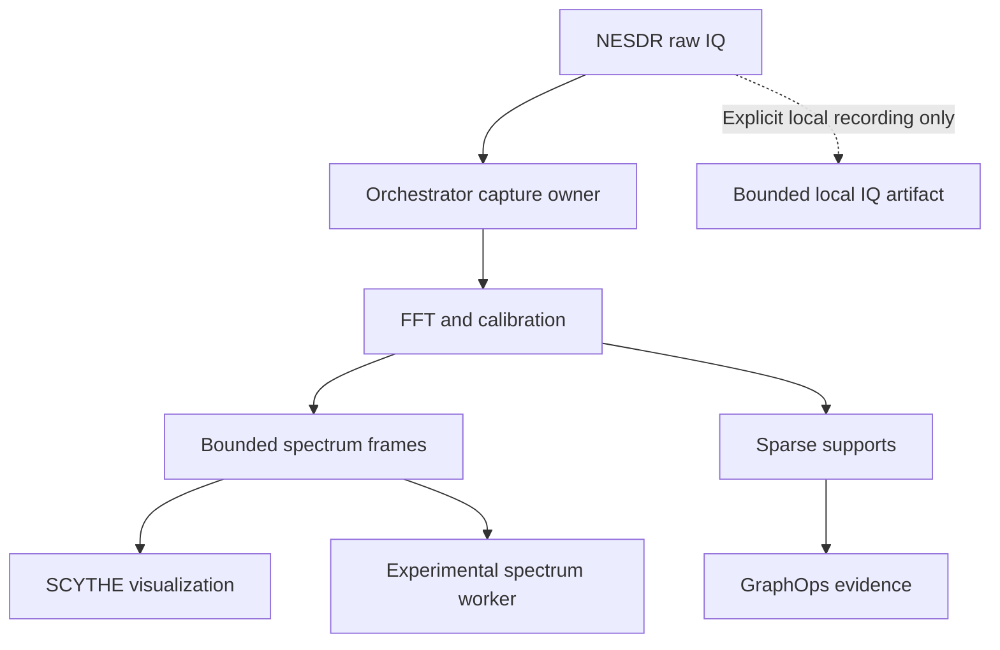

# The Globe Became an Evidence Surface: SCYTHE's Live Hypergraph, RF Field Inspector, and NESDR Product Boundary

**Date:** August 30, 2026  
**Author:** SCYTHE Core Engineering Team  
**Category:** Clarktech, GraphOps, RF Engineering, Network Operations, Evidence-Centered Computing  
**Audience:** Operators, RF researchers, network analysts, and builders of scientific visualization systems

---

SCYTHE has crossed an important line.

The system is no longer merely displaying a network beside an RF map. The live
hypergraph, Cesium globe, GraphOps workspace, NESDR receiver, and system ticker
now behave as parts of one evidence-navigation instrument.

An operator can begin with a moving flow in a bounded graph, inspect the same
activity as a geographic estimate, open the ASN or declared facility associated
with it, follow control-plane context without mistaking it for a packet route,
pin an RF field cell, and carry that selection into GraphOps. Throughout that
journey, SCYTHE keeps saying what each object is—and what it is not.

That last clause is the real advancement.

The newest work increases visual density and interaction while making the
authority boundary more explicit. It allows more to be seen without quietly
claiming that more was observed.

Open the live regional instrument at:

```text
http://127.0.0.1:5001/scythe-web/regional-rf-demo.html
```

---

## The Hypergraph Can Breathe Now

The original live view was deliberately conservative:

```text
DISPLAYED // 200 NODES // 300 EDGES
```

That bound protected the browser, but the growing Eve graph increasingly made
the viewport feel like a keyhole. Raising the limit to one large fixed number
would have moved the failure rather than solved it. A laptop, a workstation,
and a wall display do not have the same rendering budget, and even the same
machine changes behavior as labels, flow tracers, and investigation overlays
accumulate.

SCYTHE now uses three bounded detail tiers:

| Tier | Nodes | Edges | Intended use |
|---|---:|---:|---|
| Overview | 300 | 600 | Default situational awareness |
| Focused | 400 | 800 | Selected-host and neighborhood investigation |
| Max Detail | 500 | 1,000 | Explicit operator-requested density |

These are display limits, not detection limits. The status text continues to
separate the complete detected graph from the retained visual lens:

```text
DETECTED  // 821 NODES // 12867 EDGES
DISPLAYED // 300 / 821 NODES // 600 / 12867 EDGES
LENS      // ADAPTIVE_RELEVANCE
SUPPRESSED // 521N · 12267E
```

The selected host remains pinned while adaptive relevance fills the remaining
budget with active traffic, explicit signals, new arrivals, network diversity,
and stable context. `MAX DETAIL` is an operator request, not a promise to make
the GPU suffer indefinitely. Sustained slow frames step the controller down one
tier at a time and report the performance guard in the interface.

The governing relationship is now explicit:

```text
detected graph
      |
      v
adaptive relevance + pinned focus
      |
      v
requested detail tier
      |
      v
frame-time guard
      |
      v
bounded rendered graph
```

More visibility is useful. A viewport that collapses under its own ambition is
not.

---

## The Flows Started Moving Again—Truthfully

Increasing the graph limits exposed a second problem. Flow animation that was
readable at 200 nodes could disappear or become overwhelmed at 500 nodes and
1,000 edges.

The repair was not simply “draw more particles.” SCYTHE now assigns a bounded
animation budget that grows with the visible edge count and stops at a hard
ceiling. The 2D Accessible view and 3D Causal Chamber share the same motion
semantics.

More importantly, motion distinguishes two different kinds of source evidence:

- repeated Suricata counter deltas can drive measured interval motion;
- a one-shot flow summary can receive a dim bounded tracer, but it is explicitly
  not presented as a live packet rate.

Visual magnitude is logarithmic and bounded. Line width, arrow scale, and
tracer intensity may communicate retained activity, but they cannot grow
without limit or turn a cumulative counter into a real-time claim.

```text
OBSERVED COUNTER DELTA  -> interval-bearing motion
ONE-SHOT FLOW SUMMARY   -> dim presence tracer
MISSING COUNTERS        -> readable baseline, no invented activity
```

This distinction matters because animation is persuasive. A moving dot looks
like a packet even when the source supplied only an aggregate. SCYTHE now keeps
the visual energy while refusing the false precision.

---

## Cesium Markers Became Doors Into Evidence

The globe accumulated several useful labels before those labels became useful
interactions. A marker such as `FAC 14445` or `ASN 20940` named something, but
it did not yet let the operator enter the thing it named.

That has changed.

### PeeringDB facilities

Clicking a `FAC` marker now opens a typed PeeringDB facility selection. The
panel preserves the facility identity, self-reported name and location,
record-update time, and the environment ASNs that declare presence there.
Related observed hosts may be shown, but SCYTHE does not claim that their
traffic traversed the facility.

```text
FACILITY PRESENCE != OBSERVED TRAFFIC
SHARED FACILITY    != NETWORK ADJACENCY
DECLARED LOCATION  != DEVICE LOCATION
```

### ASN domains

Clicking an ASN marker opens a bounded domain investigation with inferred
prefix ownership, inferred GeoIP centroid, uncertainty, and every retained
observed host associated with the selected domain. It does not promote the
centroid into a router location or the displayed arc into a BGP path.

### Evidence tensions, observed flows, and RIS paths

The next progression turned three more display layers into investigation
surfaces:

1. **Evidence Tensions** expose both conflicting claims, their evidence
   classes, alternatives, and a falsifying observation. They do not declare a
   winner.
2. **Observed Flow Arcs** open the retained graph edge and its decoded transport
   facts. The geographic arc remains display-only and is not a physical route.
3. **RIS Paths** expose collector, peer, prefix, AS-path segments, timestamp,
   and collector-vantage authority. They remain control-plane observations, not
   proof of data-plane traversal.

This is what turned Cesium from a geographic display into an
evidence-navigation surface. The operator no longer has to infer which panel
contains the object behind a label. The label is the entrance.

---

## The NESDR Joined the Picture Without Joining the Canonical Graph

The Nooelec NESDR SMArt v5 now appears in both major visual contexts:

- as an `rf_receiver_sensor` display-context node in the live hypergraph;
- as an interactive `RF RX` point on the Cesium globe.

The receiver uses sensor identity `NESDR-SMART-V5-14530058`, but SCYTHE keeps
three claims separate:

| Claim | Authority |
|---|---|
| Configured bridge and runtime state | `RF_BRIDGE_RUNTIME_STATUS` |
| Browser-provided position and accuracy | `MEASURED_BROWSER_GEOLOCATION` |
| Physical USB attachment | `CONFIGURED_NOT_USB_ATTESTED` |

The operator must explicitly press `VANTAGE` and consent to browser location.
The resulting position is session-local display context. It is not committed
to the canonical graph and does not alter the graph revision. Clearing the
vantage removes both the globe marker and local hypergraph projection.

This gives a field receiver a meaningful place in the investigation without
claiming that a browser coordinate is a permanent sensor survey or that a
configured serial number proves the USB device is currently producing samples.

---

## “WEB MONOCLE” Became the RF Field Inspector

The regional globe already had a real RF instrument hiding behind an unclear
name. Every ten seconds, the old Web Monocle sampled the NTIA ITM contract at
the camera location and drove the coverage grid, transmitter marker, range
ring, bearing line, and uncertainty halo.

It worked, but its interaction model was opaque. It sampled the camera even
when the operator cared about a cell under the pointer. A clicked cell entered
GraphOps without visibly becoming the instrument's retained subject. The panel
also occupied the bottom center permanently and displayed an irrelevant optics
row during an RF-only scenario.

The replacement is explicit:

```text
RF FIELD INSPECTOR // 900 MHz
```

It has three sampling modes:

- **CAMERA** follows the Cesium camera, preserving the original behavior.
- **HOVER** previews the RF cell beneath the pointer.
- **PINNED** locks the inspector to a selected cell while the camera moves.

Clicking a coverage cell now pins the inspector, retains the selection, and
opens or activates its RF investigation context. The expanded view reports the
contract value, display value, delta, threshold decision, solver identity,
dataset hash, uncertainty, and evidence class. The panel collapses into a
compact status rail when no cell needs attention, and optical content stays
absent unless an optical dataset is actually active.

The intended loop is finally visible:

```text
inspect RF field
      -> hover a cell
      -> pin authoritative evidence
      -> select a graph entity
      -> correlate in GraphOps
      -> visualize the bounded result
```

The Hypergraph and InfraFlow layers now serve this loop instead of competing
with it.

---

## The Bottom Rail Became a System Evidence Ticker

The former bottom notice repeated a static disclaimer:

```text
SOLVER OUTPUT // DERIVED UINT16 VIEW // VISUALIZATION IS NOT AUTHORITATIVE
```

That statement was true, but a permanent strip of static truth was wasting the
best operational real estate on the page.

SCYTHE now uses the full browser width for a read-only System Evidence Ticker.
It summarizes the bounded graph revision, Eve commit and replay state, protocol
mix, operational direction, host liveness, evidence tensions, current focus,
and RF product freshness.

The ticker is not a second authority surface. It summarizes existing bounded
state. Motion can be paused without freezing the information itself, and
screen-reader announcements are throttled to material changes rather than
every visual cycle. RF requests are abortable, and stale data remains labelled
stale.

Most recently, the RF wording changed from a negative capability statement:

```text
RAW IQ NOT EXPOSED
```

to an operational product declaration:

```text
RF PRODUCTS // FFT LIVE · SPARSE EVENTS LIVE · RAW IQ LOCAL ONLY
```

or, when acquisition and analysis are not fresh:

```text
RF PRODUCTS // FFT STALE · SPARSE EVENTS STALE · RAW IQ LOCAL ONLY
```

This is more than copy editing. `IQ CONNECTED`, `FFT LIVE`, and `SPARSE EVENTS
LIVE` are different facts. A socket can be connected while transforms have
stopped. FFT frames can be fresh while a sparse-analysis window is stale. The
ticker now derives its text from separate machine-readable product states.

---

## Raw IQ Remains Local by Design

Even at 2.048 MS/s with unsigned 8-bit interleaved I/Q, a receiver produces
roughly:

```text
4.096 MB/s
245.76 MB/minute
14.75 GB/hour
353.89 GB/day
```

The currently configured Int16 bridge uses twice that byte width. The point is
not to advertise a storage target; it is to show how quickly routine raw-sample
transport becomes the wrong default.

Bandwidth is only the first reason not to treat raw IQ as another browser
payload. IQ can preserve recoverable modulation, voice, identifiers, packet
contents, and timing structure from communications that were not the subject
of the investigation.

The operational boundary is therefore:



Raw IQ does not enter browser transport, GraphOps model context, Ollama Cloud,
or permanent graph storage. A future recording escape hatch can be explicit,
duration-limited, locally encrypted, hash-addressed, retention-bound, and
disabled by default. It is not part of routine acquisition.

---

## Product Health Is Now Machine-Readable

`GET /api/graphops/rf-bridge/status` now declares the product boundary directly:

```json
{
  "bridge": {
    "capture_owner": "orchestrator",
    "raw_iq_scope": "local_process_only",
    "raw_iq_browser_exposed": false,
    "products": {
      "fft_frames": {
        "state": "live",
        "fft_size": 4096,
        "published_bins": 512,
        "native_bin_width_hz": 500.0,
        "analysis_bin_width_hz": 4000.0,
        "authority": "derived_observation"
      },
      "sparse_supports": {
        "state": "live",
        "model": "M1",
        "latest_outcome": "NOISE_COMPATIBLE",
        "authority": "derived_inference"
      }
    }
  }
}
```

FFT freshness is derived from the latest transformed frame, not merely the IQ
connection. Sparse freshness is derived independently from the latest completed
analysis window. Native FFT resolution and published analysis resolution remain
separate numbers because a 4096-point FFT at 2.048 MS/s has 500 Hz native bins,
while the bounded 512-bin product has 4 kHz analysis bins.

At publication time, the live service correctly reports both products as
`STALE` because the local IQ Exporter socket on `127.0.0.1:1234` is refusing the
connection. SCYTHE does not substitute demo samples or keep displaying `LIVE`
because the receiver is configured.

---

## NerfEngine Receives a Spectrum, Not an FFT of an FFT

NerfEngine contains useful experimental signal machinery: spectrum encoding,
spectral token reduction, positional treatment, and attention-oriented feature
compression. It also contains a much larger repository of unrelated
applications, models, backups, demonstrations, and web dependencies.

SCYTHE therefore did not import the entire repository. It retained the single
self-contained `SignalIntelligence/core.py`, pinned its upstream commit and
pre-adapter SHA-256, and added one deliberately separate method:

```python
process_spectrum_frame(power_db, ...)
```

This method consumes calibrated spectral power without calling FFT again. A
SCYTHE magnitude spectrum must never be sent through NerfEngine's IQ entry
point; doing so would transform an already transformed product and manufacture
spectral artifacts.

The exchange uses the versioned contract:

```text
scythe.rf.spectrum.v1
```

It carries frame identity, sensor identity, capture time, center frequency,
sample rate, FFT size, window, native and analysis bin widths, bounded power
bins, clock quality, tuner calibration, gain, signal-chain hash, and
`authority: derived_observation`. Unknown fields—including any attempted
`raw_iq` field—are rejected.

NerfEngine returns a separate result family:

```json
{
  "schema": "nerfengine.rf.analysis.v1",
  "result": "FEATURES_EXTRACTED",
  "confidence": 0.0,
  "authority": "experimental_inference",
  "promotion": "not_graph_evidence"
}
```

The adapter refuses any worker output that attempts to identify itself as an
observation or graph evidence. Neural features may annotate an investigation;
they do not become evidence because a model produced them.

---

## Cloud Reasoning Now Fails Closed on Time

The same evidence discipline applies when GraphOps asks Ollama Cloud to analyze
a full-fidelity capsule.

A recent investigation remained in `ANALYZING` for several minutes despite
successful model discovery. That exposed a health distinction similar to the
RF product distinction: discovering a model does not prove that generation is
available.

The Cloud path now has a bounded response-start deadline. If Ollama Cloud does
not begin responding within 75 seconds, the server returns a structured,
retryable `504` with the failure stage identified. The browser retains its own
bounded wait and exposes `STOP WAITING`. SCYTHE does not silently retransmit the
exact evidence capsule to another model.

```text
DISCOVERY HEALTH != GENERATION HEALTH
TIMEOUT          != EMPTY ANSWER
RETRYABLE        != AUTOMATIC REDISCLOSURE
```

The capsule remains exact, selection-bound, and explicit-disclosure-only. The
failure is visible without weakening the boundary.

---

## Verification

The latest acceptance run completed with:

```text
47 Python RF + GraphOps tests // PASS
133 SCYTHE-Web tests          // PASS
RF product contract tests     // PASS
FFT-of-FFT negative test      // PASS
worker evidence-promotion test // PASS
orchestrator restart          // ACTIVE
live RF status contract       // VERIFIED
```

The tests specifically verify that:

- detail tiers remain bounded and step down under sustained slow frames;
- flow animation retains measured-delta versus one-shot semantics;
- facilities, ASNs, tensions, observed flows, and RIS paths emit distinct typed
  selections;
- the RF receiver remains display context rather than canonical graph state;
- the RF Field Inspector pins cells and retains authoritative versus display
  values;
- ticker product text comes from declared product state;
- spectrum frames cannot contain raw IQ or unknown fields;
- the NerfEngine spectrum path does not call FFT;
- experimental worker output cannot promote itself into graph evidence;
- the broker-proxy RF read path still depends on orchestrator loopback
  authorization;
- Cloud timeout behavior remains structured and fail-closed.

---

## What Comes Next

The immediate operational step is straightforward: restore the SDR++ IQ
Exporter on loopback and observe the ticker transition from `STALE` to `LIVE`
for FFT and sparse products independently.

The research progression should remain equally disciplined:

1. Run NerfEngine annotations against labeled local spectrum recordings,
   controlled emitters, noise-only windows, and out-of-distribution signals.
2. Record model revision, contract frame identity, calibration, and result hash
   for every experimental annotation.
3. Measure false-positive rate and stability before considering any promotion
   path beyond `not_graph_evidence`.
4. Add the raw-IQ recording escape hatch only as an explicit local operation
   with byte, duration, encryption, and retention limits.
5. Continue turning globe objects into typed evidence entrances while refusing
   display geometry as route, location, or causality proof.

SCYTHE can now show more of the graph, keep its motion readable, let the globe
open investigations, place a field receiver in the operator's world, publish
truthful RF product health, and invite an experimental neural worker into the
pipeline without surrendering evidence authority.

The system did not become more credible by hiding uncertainty. It became more
useful by making uncertainty interactive.

---

## Project References

- [Eve Live Hypergraph](./Eve_Live_Hypergraph.md)
- [SDR++ Edge Bridge](./SDRPP_EDGE_BRIDGE.md)
- [GraphOps InfraFlow](./GraphOps_InfraFlow.md)
- [GraphOps Full-Fidelity Cloud](./GraphOps_Full_Fidelity_Cloud.md)
- [The Globe as a Hypothesis Compiler](./regional_rf_demo_blog_post.md)
- [The Network Learned to Disagree](./infraflow_full_fidelity_blog_post.md)
- [The Working Instrument](./scythe_working_instrument_blog_post.md)
